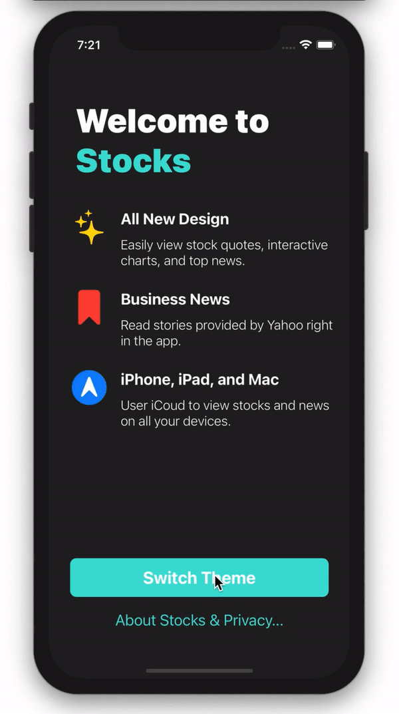
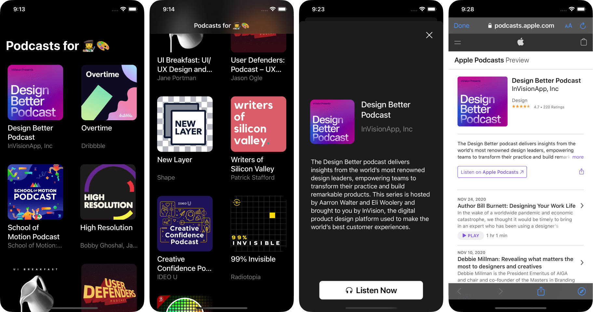
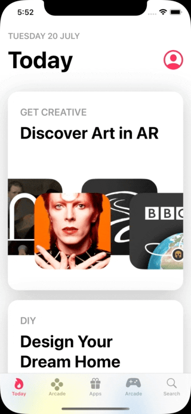
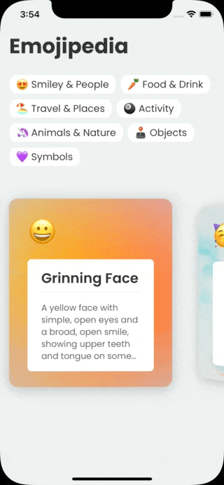
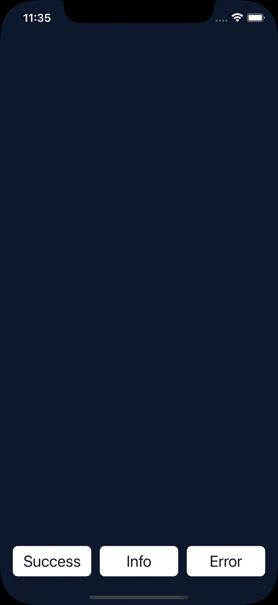

# Learn SwiftUI

Documenting my journey of learning SwiftUI.

## 01 Recreate the Apple Stocks Welcome screen

- SF Symbols
- @State, @Binding
- Toggle drak/light theme
- Credit & inspiration: Apple Stocks, Sean Allen

## 02 Podcasts for Designers 👩‍🎨🎨

- Grid 
- Basic Model-View-View Model (MVVM)

## 03 Recreate App Store Today

- matchedGeometryEffect

## 04 3D Scroll Effect

- GeometryReader, rotation3DEffect
- Swift Package: [WrappingHStack](https://github.com/dkk/WrappingHStack)
- Custom fonts: Google Font - Poppins
- Background image source: Unsplash
- Data source: [Emojipedia](https://emojipedia.org/)

## 05 Notification Banner

- ViewModifier
- Icons: [Phosphor Icons](https://phosphoricons.com/)

